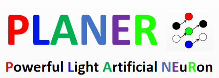
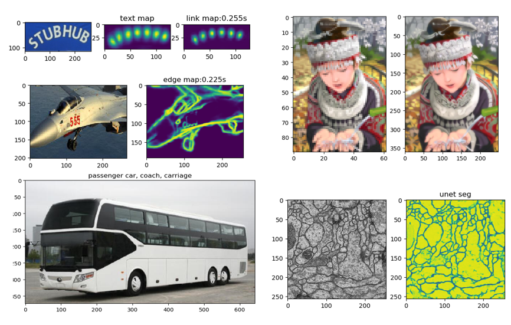

## Planer: Powerful Light Artificial NEuRon



A powerful light-weight inference framework for CNN. The aim of planer is to provide efficient and adaptable inference environment for CNN model. Also in order to enlarge the application scope, we support ONNX format, which enables the converting of trained model within various DL frameworks (PyTorch).  

## Features
* Extremely streamlined IR
* [CuPy](https://github.com/cupy/cupy) based GPU-oriented array computing ability
* Powerful model visualization tools
* ONNX supported model converting
* Plenty of inspiring demos

## Various Building Options
All the elements (layers, operations, activation fuctions) are abstracted to be ```layer```, and a json formatted ```flow``` is applied to build the computation graph. We support 3 ways of building a network:
* PyTorch-like
```python
from planer import *
# ========== write a net manually ========== 
class CustomNet(Net):
    def __init__(self):
        self.conv = Conv2d(3, 64, 3, 1)
        self.relu = ReLU()
        self.pool = Maxpool(2)
        self.upsample = UpSample(2)
        self.concatenate = Concatenate()
        self.sigmoid = Sigmoid()

    def forward(self, x):
        x = self.conv(x)
        x = self.relu(x)
        y = self.pool(x)
        y = self.upsample(y)
        z = self.concatenate([x, y])
        return self.sigmoid(z)
```
* Json-like (based on our IR)
```python
# ========== load net from json ========== 
layer = [('conv', 'conv', (3, 64, 3, 1)),
        ('relu', 'relu', None),
        ('pool', 'maxpool', (2,)),
        ('up', 'upsample', (2,)),
        ('concat', 'concat', None),
        ('sigmoid', 'sigmoid', None)]

flow = [('x', ['conv', 'relu'], 'x'),
        ('x', ['pool', 'up'], 'y'),
        (['x','y'], ['concat', 'sigmoid'], 'z')]

net = Net()
net.load_json(layer, flow)
```

* ONNX-converted (all the demos)

A example of converting torchvision resnet18 model can be seen in ```planer_onnx/``` folder. 

## Network visualization

We provide a powerful visualization tools for the cnn model. Just call ```net.show()``` will work.


## Demos
We have released some demos, which can be investigated inside ```demo/``` folder.




